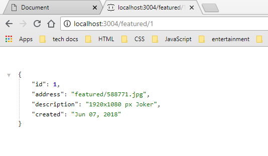
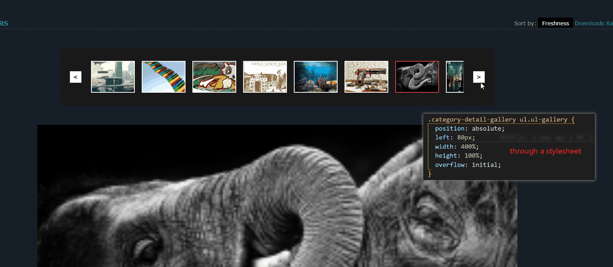
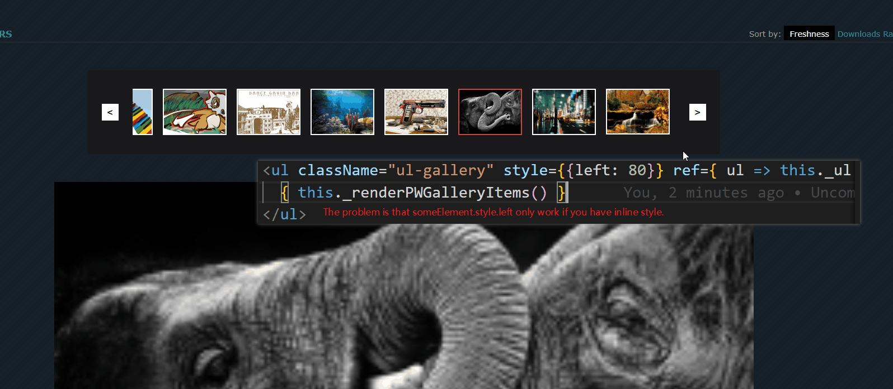
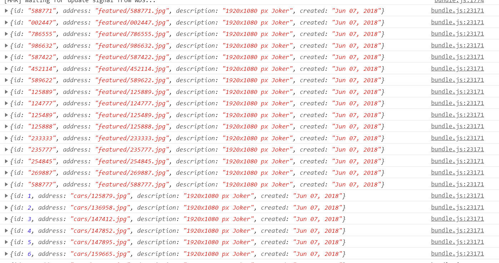

# README

## min-width


## 代码分离

components文件夹放木偶组件（公共组件）

containers文件夹放页面智能组件（子页面）

未实施，似乎不适用于单页面应用

## 哈希值发生变化时

当哈希值发生变化时，componentWillReceiveProps钩子函数会被触发，在这个函数中发AJAX请求。

官方已不推荐使用 componentWillReceiveProps

建议使用 componentDidUpdate 替代

## json-server

> json-server --watch db.json --port 3004

☆这种接口怎么写？

localhost:3004/categories/cars

## NavLink

to属性的值要带'/'，折腾了半天！！！

```js

import React from 'react'
import { NavLink as Link } from 'react-router-dom'

export default function PWCategoriesItem ({ category }) {
  return (
    <li className="ul-categories-item">
      {/* category的值为：cars、nature... to属性要求的值要带 '/' */}
      <Link to={`/${category}`} activeClassName="current">{ category }</Link>
    </li>
  )
}

```

## 刷新后路由匹配出问题

URL的值为：localhost:3000/nature，但显示了localhost:3000/的内容

如何解决？

> 解决方案：

```js

constructor(props) {

  super(props)
  // console.warn(`PWWallpapers组件生命周期钩子：constructor`)

  this.state = {
    listItems: this.props.initListItems,
    currentPath: this.props.location.pathname
  }
}

componentDidMount(props) {
  console.warn(`PWWallpapers组件生命周期钩子：componentDidMount`)
  const { currentPath } = this.state
  const path = currentPath === '/' ? `/featured`: currentPath
  this._doFetch(path)
}

```

## 详情页如何获取数据



## 详情页应该带着分类，分类图片应该有好几张，目前只有一张有问题

## 如何获取ul的left值

The problem is that someElement.style.left only work if you have inline style. Since you apply your styling through a stylesheet, you will not be able to fetch the value the way you expect.

Not work when is through a stylesheet.



Only work when is inline-style.



```js
function getCssProperty(elmId, property){
   var elem = document.getElementById(elmId);
   return window.getComputedStyle(elem,null).getPropertyValue(property);
}
// You could now get your value like
var left = getCssProperty("my-div", "left");
```

参考资料：

<https://stackoverflow.com/questions/13778439/how-to-get-the-css-left-property-value-of-a-div-using-javascript>

## 路由匹配一次componentDidMount会触发*两次*是否正常？

问题：_renderPWListItem执行了（console.log(item)打印了）两次



## _renderPWListItem执行次数异常

▽解决方案：**加isLoaded做节流，避免多余的渲染**

2018年6月14日06:15:51
_renderPWListItem执行了4次！！！！

## 待解决

- _renderPWListItem执行次数异常
- 路由匹配一次componentDidMount会触发*两次*是否正常？
- **ulGalleryMinLeft的值目前是写死的，待优化**
- detail页刷新后，gallery列表left值恢复成80▽，应该为当前展示的图片的位置

## 可选项

1. 注册
2. 登录
3. 登录验证
4. 面包屑导航
5. 筛选