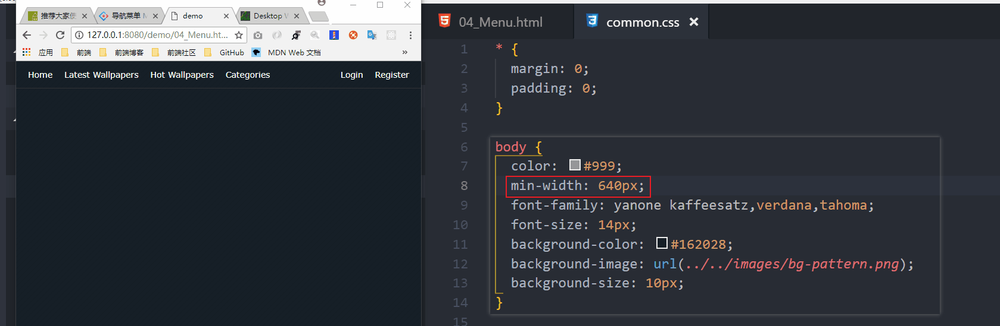

# README

## min-width



## 代码分离

components文件夹放木偶组件（公共组件）

containers文件夹放页面智能组件（子页面）

## 哈希值发生变化时

componentWillReceiveProps钩子函数会被触发，发起ajax请求

## json-server

99_mock-data

> json-server --watch db.json --port 3004

localhost:3004/categories/cars 怎么写？？？

## NavLink

to属性的值要带'/'，折腾了半天！！！

```js

import React from 'react'
import { NavLink as Link } from 'react-router-dom'

export default function PWCategoriesItem ({ category }) {
  return (
    <li className="ul-categories-item">
      {/* category的值为：cars、nature... to属性要求的值要带 '/' */}
      <Link to={`/${category}`} activeClassName="current">{ category }</Link>
    </li>
  )
}

```

## 刷新后路由匹配出问题

localhost:3000/nature

显示localhost:3000/的内容

怎么解决？
2018年6月11日20:23:51

路由匹配一次componentDidMount会触发*两次*是否正常？

> 解决方案：

```js

constructor(props) {

  super(props)
  // console.warn(`PWWallpapers组件生命周期钩子：constructor`)

  this.state = {
    listItems: this.props.initListItems,
    currentPath: this.props.location.pathname
  }
}

componentDidMount(props) {
  console.warn(`PWWallpapers组件生命周期钩子：componentDidMount`)
  const { currentPath } = this.state
  const path = currentPath === '/' ? `/featured`: currentPath
  this._doFetch(path)
}

```