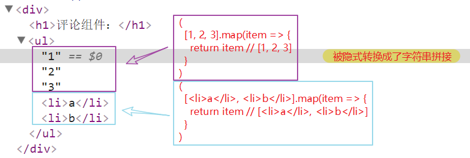
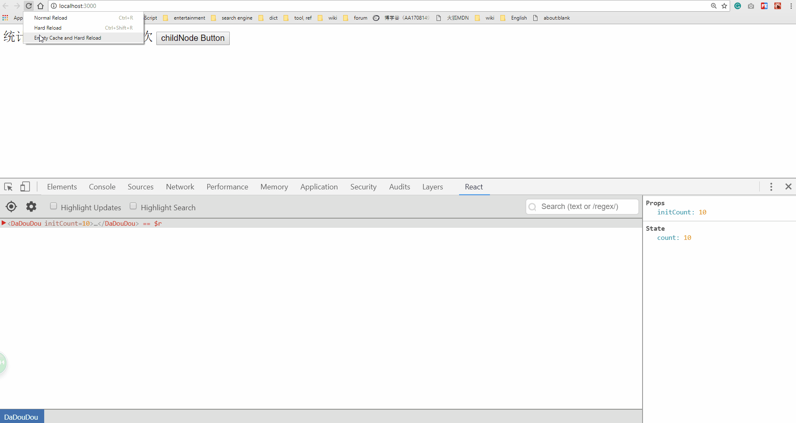
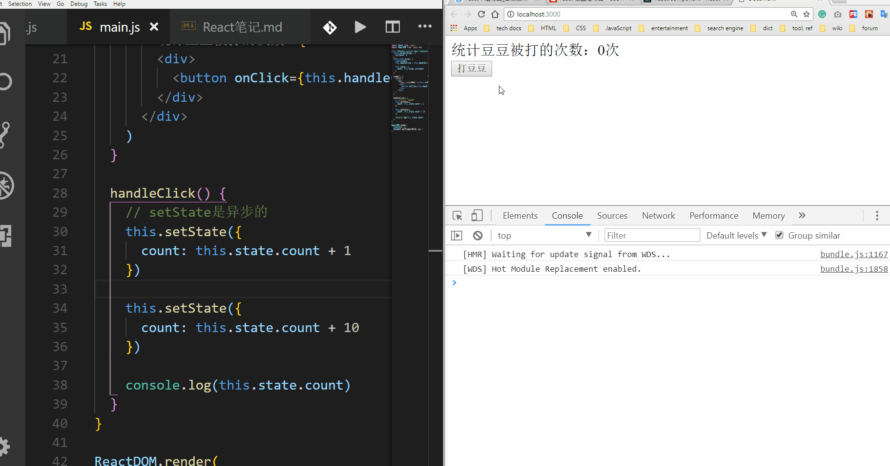
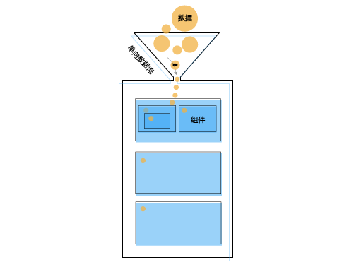
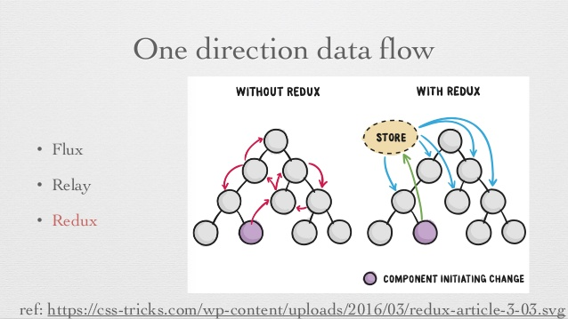
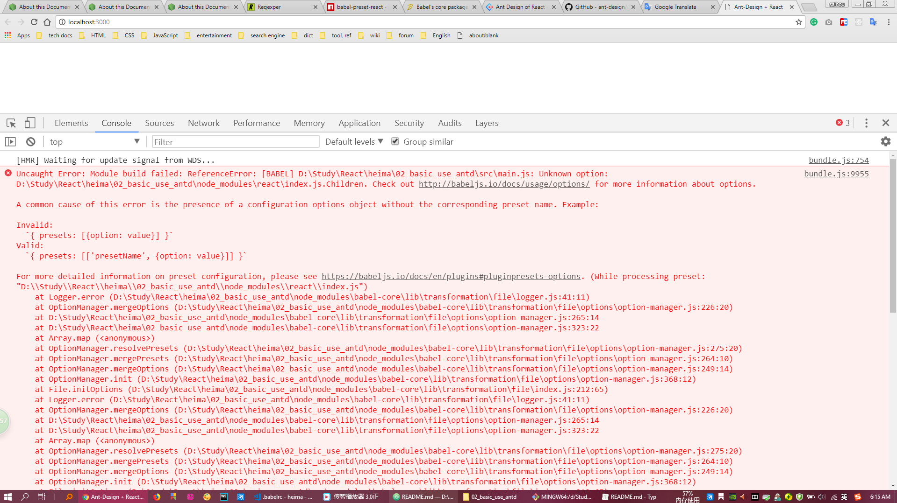
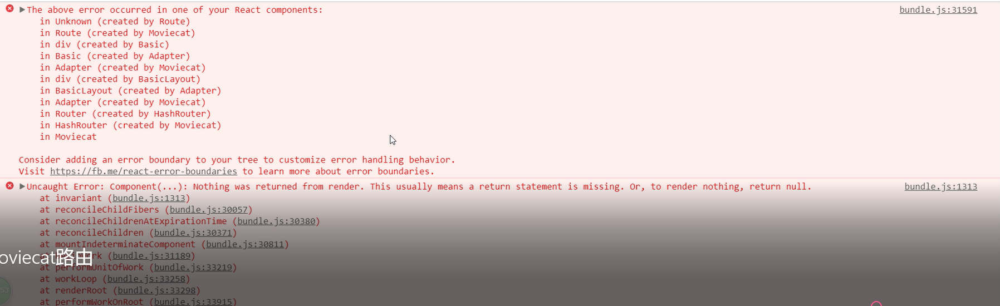
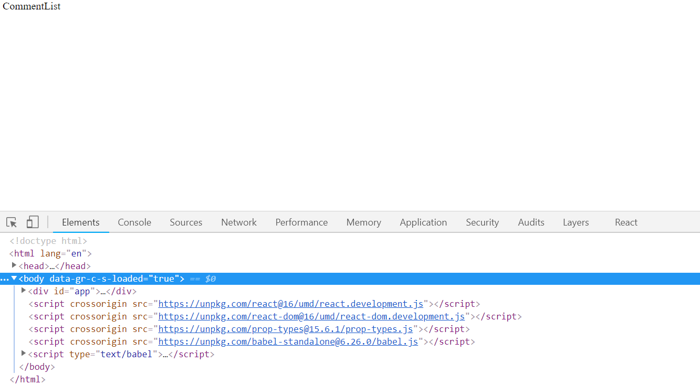

# React笔记

## createElement的说明

```js

// 1 导入react和react-dom
// react 是核心包
// react-dom 是渲染DOM的包
import React from 'react';
import ReactDOM from 'react-dom';

// 2 创建 react元素
// 第一个参数表示：要创建元素的名称
// 第二个参数表示：要创建元素的自身属性，如果没有属性，可以使用null
// 第三个参数表示：要创建元素的子节点（1 文本节点 2 元素节点）
// const dv = React.createElement('div', null, '这是通过 React 创建的第一个React元素');
// const lbl = React.createElement('label', { htmlFor: 'ipt' }, '姓名');
const dv = React.createElement('div', {title: '我是标题', className: 'c-dv'}, '这是通过 React 创建的第一个React元素');

// 3 渲染 react元素
// 第一个参数表示：要渲染的元素
// 第二个参数表示：把元素渲染到页面中的哪个元素中
ReactDOM.render(dv, document.getElementById('app'));

```

## JSX的基本使用

```js

// 1 导入react和react-dom
// react 是核心包
// react-dom 是渲染DOM的包
import React from 'react';
import ReactDOM from 'react-dom';

// 2 创建 react元素
// JSX：JavaScript XML，也就是在JS代码中书写HTMl结构
// 注意：因为JS引擎无法识别JSX语法，所以，需要使用对应的loader来对JSX进行转化后，才能在浏览器中使用
const dv = <div title="我是标题" className="cls">这是通过 React 创建的第一个 React元素 -- JSX</div>;

// 3 渲染 react元素
// 第一个参数表示：要渲染的元素
// 第二个参数表示：把元素渲染到页面中的哪个元素中
ReactDOM.render(dv, document.getElementById('app'));

```

## JSX中使用JS变量

```js

// 1 导入react和react-dom
import React from 'react';
import ReactDOM from 'react-dom';

// 动态数据
const num = 123;

let add = (a, b) => a + b;

// 2 创建 react元素
// 注意：通过 {} 来使用JS中提供的数据（变量）
// 注意：{} 中可以出现任意的JS表达式
// const dv = (<div>使用JS提供的变量：{ num }</div>);
// const dv = (<div>使用JS提供的变量：{ num + 'abc' }</div>);
const dv = (<div>使用JS提供的变量：{ add(3, 5) }</div>);

// 3 渲染 react元素
ReactDOM.render(dv, document.getElementById('app'));

```

## 无状态组件（函数组件）的基本使用

```js

// react 是组件化的开发方式，组件是 react 中最重要的一个概念

// react 中有两种组件
// 1 无状态组件：
//    使用函数创建的组件称为无状态组件
// 2 有状态组件：
//    使用类（class）创建的组件称为有状态组件 

// react中的数据称为：状态（state）

import React from 'react';
import ReactDOM from 'react-dom';

// 创建无状态组件
// 注意：
//  1 函数一定要有返回值（return），并且返回值只能是：null或者JSX（或者字符串）
//  2 如果函数的返回值为null，表示这个组件中没有任何内容
//  3 如果这个组件中需要渲染内容，那么，函数需要返回 JSX
//  4 直接将函数名称作为组件名称来渲染（<Hello />）
//  5 组件的名称是一大写字母开头（首字母大写 是用来区分组件和普通react元素）
//  6 推荐：在组件返回JSX内容的外部使用小括号()包裹
let str = 'cai-feng';

function Hello() {
  // return null
  // return `great${str}`;
  return (
    <h1 style={{ color: 'red', fontWeight: 400 }}>React好酷</h1>
  );
}

// 渲染组件
ReactDOM.render(
  <Hello />,
  document.getElementById('app')
);

```

## 给组件传递数据

```js

import React from 'react';
import ReactDOM from 'react-dom';

// 创建无状态组件
function Hello(props) { // props 不是固定的
  // 1 props 是一个对象，对象中就是传递给组件的数据
  // 2 props 是只读的对象
  //    2.1 props中的属性是只读的
  //    2.2 无法修改或给props添加属性
  //    也就是说：只能读取props中的数据，无法修改props的数据

  // props.age = 22; // Cannot assign to read only property 'age' of object '#<Object>'
  // props.nation = 'USA'; // object is not extensible
  console.log(props.age); // 18
  console.log(props.hobby); // ['majon', 'ski']
  console.log(props);
  return (
    <div>函数组件 - Hello { props.hobby[1] }</div>
  );
}

ReactDOM.render(
  <Hello gender="男" age={ 18 } hobby={ ['majon', 'ski'] } eat={ function () {} } />,
  document.getElementById('app')
);

```

## 有状态组件的基本使用

```js

import React from 'react';
import ReactDOM from 'react-dom';

// 创建有状态组件 - class
// 注意:
//  1 通过class创建类需要继承自 React.Component
//  2 必须提供 render 方法
//  3 render方法必须有返回值, 返回null表示什么都不渲染, 返回JSX表示渲染内容
//  4 组件必须只有一个唯一的根元素(函数组件也是)
class Hello extends React.Component {
  render() {
    return (
      <div>
        <h1>这是通过 class 创建的有状态组件</h1>
      </div>
    );
  }
}

ReactDOM.render(
  <Hello/>, document.getElementById('app')
);

```

## 有状态组件state的说明

```js

import React from 'react';
import ReactDOM from 'react-dom';

// 创建有状态组件 - class
// 注意:
//  1 通过class创建类需要继承自 React.Component
//  2 必须提供 render 方法
//  3 render方法必须有返回值, 返回null表示什么都不渲染, 返回JSX表示渲染内容
//  4 组件必须只有一个唯一的根元素(函数组件也是)
class Hello extends React.Component {
  constructor() {
    super();

    // 初始化组件的状态(数据)
    // 相当于 Vue中的data, 用来给组件提供数据
    // 特点:
    //  1 状态是属于组件的(私有), 一组件的状态只能在当前组件中使用
    //  2 state 提供的状态是可以改变的
    //  3 不能以 this.state.msg = '' 的方式直接修改状态!!!
    //  4 需要通过 this.setState({ msg: '新值' }) 来修改状态
    this.state = {
      msg: '这是组件自己的状态(数据)'
    };
  }
  render() {
    return (
      <div>
        { /* 通过 this.state.msg 来访问到组件自己的状态 */ }
        <h1>这是通过 class 创建的有状态组件 { this.state.msg }</h1>
      </div>
    )
  }
}

ReactDOM.render(
  <Hello/>, document.getElementById('app')
);

```

## 绑定事件

```js

import React from 'react'
import ReactDOM from 'react-dom'

// 创建有状态组件 - class
class Hello extends React.Component {
  constructor() {
    super()

  }

  // 渲染
  render() {
    return (
      <div>
        {/*
          绑定事件: on + 事件名称(大写字母开头)
          这样驼峰命名法来给react元素添加事件
        */}
        <button
          onClick={this.handleClick}
          onMouseEnter={this.handleMouseEnter }
          onMouseLeave={this.handleMouseLeave}>触发事件</button>
        {/* <button onClick={function () { console.log('事件触发了') }}>触发事件</button> */}
      </div>
    )
  }

  // 按钮的单击事件
  handleClick() {
    console.log('单击事件触发了');
  }
  handleMouseEnter() {
    console.log('鼠标移上来了');
  }
  handleMouseLeave() {
    console.log('鼠标离开了了');
  }
}

ReactDOM.render(
  <Hello />,
  document.getElementById('app')
)

```

## 处理 this 指向（1）

```js

import React from 'react'
import ReactDOM from 'react-dom'

// 在 react 中有两种方式来解决 this 指向的问题:
// 1 箭头函数
// 2 bind方法
// 有状态组件方法中的 this 是: 当前类组件的实例对象

// 创建有状态组件 - class
class Hello extends React.Component {
  constructor() {
    super()

    // 初始化状态
    this.state = {
      msg: '默认值'
    }
  }

  // 渲染
  render() {
    return (
      <div>
        <h1>{ this.state.msg }</h1>
        <button onClick={this.handleClick}>触发事件</button>
      </div>
    )
  }

  // 按钮的单击事件
  // 注意: 这个语法不是ES的规范, 需要使用 stage-2 来解析这个语法
  handleClick = () => {
    // 默认情况下, 事件的处理函数中是无法获取到 this 的
    console.log('单击事件触发了', this); // this 的值为 undefined

    this.setState({
      msg: '修改后的数据'
    })
  }
}

ReactDOM.render(
  <Hello />,
  document.getElementById('app')
)

```

## 处理 this 指向（2）

```js

import React from 'react'
import ReactDOM from 'react-dom'

// 在 react 中有两种方式来解决 this 指向的问题:
// 1 箭头函数
// 2 bind方法
//
// 有状态组件方法中的 this 是: 当前类组件的实例对象

// 创建有状态组件 - class
class Hello extends React.Component {
  constructor() {
    super()

    // 初始化状态
    this.state = {
      msg: '默认值'
    }
  }

  // 渲染
  render() {
    return (
      <div>
        <h1>{ this.state.msg }</h1>

        {/* 使用箭头函数包裹事件处理程序，因为箭头函数中的this是外部render方法中的this，而 render 方法中的this就是：当前组件的实例对象 */}
        <button onClick={() => { this.handleClick() } }>触发事件</button>
      </div>
    )
  }

  // 按钮的单击事件
  handleClick(){
    console.log('单击事件触发了', this);

    this.setState({
      msg: '修改后的数据'
    })
  }
}

ReactDOM.render(
  <Hello />,
  document.getElementById('app')
)

```

## 处理 this 指向（3）

```js

import React from 'react'
import ReactDOM from 'react-dom'

// 在 react 中有两种方式来解决 this 指向的问题:
// 1 箭头函数
// 2 bind方法
//
// 有状态组件方法中的 this 是: 当前类组件的实例对象

// 创建有状态组件 - class
class Hello extends React.Component {
  constructor() {
    super()

    // 通过 bind 绑定this，来处理事件中this的指向
    this.handleClick = this.handleClick.bind(this)

    // 初始化状态
    this.state = {
      msg: '默认值'
    }
  }

  // 渲染
  render() {
    return (
      <div>
        <h1>{ this.state.msg }</h1>
        <button onClick={ this.handleClick }>触发事件</button>
      </div>
    )
  }

  // 按钮的单击事件
  handleClick(){
    console.log('单击事件触发了', this);

    this.setState({
      msg: '修改后的数据'
    })
  }
}

ReactDOM.render(
  <Hello />,
  document.getElementById('app')
)


// ---------------- bind的用法 ------------------
// 任意的函数都可以调用bind方法，bind方法是 Function.prototype 中提供的
// console.dir(Function.prototype);

// bind方法的作用：
// 1 返回新函数
// 2 修改this的指向

const obj = {
  name: '对象obj',
  fn: function () {
    console.log(this);
  }
}

// obj.fn()
const foo = obj.fn

// 调用 foo.bind 后
// 1 返回了一个新函数 foo1
// 2 返回的新函数foo1中的this已经与 obj 绑定到一起了
const foo1 = foo.bind(obj)
foo1()

```

## 有状态组件和无状态组件的对比

```js

// 有状态组件 和 无状态组件的对比：
// 最主要的区别：有没有状态（state）
// 对于有状态组件来说，可以添加事件修改状态 或者 发送请求后修改状态 等等这些操作
// 对于无状态组件来说，只能用来展示数据！！！
// 该使用哪个组件？？？
// 如果仅仅需要展示一块内容，此时就用：无状态组件
// 如果有逻辑操作（获取数据、绑定单击事件等），此时就用：有状态组件
// 有状态组件负责提供数据，无状态组件负责渲染内容。也就是：有状态组件将组件中的数据传递给无状态组件，由无状态组件负责渲染这个数据。

// 有状态组件 --> 智能组件
// 无状态组件 --> 木偶组件

// 创建有状态组件 - class
class Hello extends React.Component {
  constructor() {
    super()

    // 通过 bind 绑定this，来处理事件中this的指向
    this.handleClick = this.handleClick.bind(this)

    // 初始化状态
    this.state = {
      msg: '默认值'
    }
  }

  // 渲染
  render() {
    return (
      <div>
        <h1>{ this.state.msg }</h1>
        <button onClick={ this.handleClick }>触发事件</button>
      </div>
    )
  }

  // 按钮的单击事件
  handleClick(){
    console.log('单击事件触发了', this);

    this.setState({
      msg: '修改后的数据'
    })
  }
}

```

## 有状态组件通过props获取数据

```js

// 创建有状态组件 - class
// 在类组件中，通过 this.props 来获取到传递给组件的数据
// props 还是只读的属性，只能读取props中的内容，而不能修改

class Hello extends React.Component {
  constructor(props) {
    super(props)

    console.log(this.props); // {name: 'jack'}
    // console.log(props); // {name: 'jack'}
  }

  // 渲染
  render() {
    // console.log(this.props); // {name: 'jack'}

    return (
      <div>
        <h1>{ this.props.name }</h1>
      </div>
    )
  }
}

ReactDOM.render(
  <Hello name="jack" />,
  document.getElementById('app')
)

```

## JSX emmet 组合键

ctrl + alt + e

## 评论组件功能实现

```js

class CommentList extends React.Component {
  constructor(props) {
    super(props)

    this.state = {
      list: [
        { id: 1, user: '张三', content: '哈哈，沙发' },
        { id: 2, user: '张三2', content: '哈哈，板凳' },
        { id: 3, user: '张三3', content: '哈哈，凉席' },
        { id: 4, user: '张三4', content: '哈哈，砖头' },
        { id: 5, user: '张三5', content: '哈哈，楼下山炮' }
      ]
    }
  }

  render() {
    return (
      <div>
        <h1>评论组件：</h1>
        <ul>
          {
            this.renderList()
          }

        </ul>
      </div>
    )
  }

  renderList() {
    return this.state.list.map(item => {
      return (
        <li key={ item.id }>
          <h2>评论人：{ item.user }</h2>
          <p>评论内容：{ item.content }</p>
        </li>
      )
    })
  }
}

```

## 返回值是数组但被隐式转换成了字符串拼接

Normally, JavaScript expressions inserted in JSX will evaluate to a `string`, a React element, or `a list of those things`. However, props.children works just like any other prop in that it can pass any sort of data, not just the sorts that React knows how to render. For example, if you have a custom component, you could have it take a callback as props.children:

```js

class CommentList extends React.Component {
  constructor(props) {
    super(props)

    this.state = {
      list: [
        { id: 1, user: '张三', content: '哈哈，沙发' },
        { id: 2, user: '张三2', content: '哈哈，板凳' },
        { id: 3, user: '张三3', content: '哈哈，凉席' },
        { id: 4, user: '张三4', content: '哈哈，砖头' },
        { id: 5, user: '张三5', content: '哈哈，楼下山炮' }
      ]
    }
  }

  render() {
    return (
      <div>
        <h1>评论组件：</h1>
        <ul>
          {/* {
            // this.renderList()
            [1, 2, 3].map(item => {
              return item // '123'
            })
          }
          {
            [<li>a</li>, <li>b</li>].map(item => {
              return item
            })
          } */}
          {
            [true, true, false].map(item => {
              return item // 布尔值时结果为空
            })
          }
          {
            [function a() {}, function b() {}].map(item => {
              return item // 非法
            })
          }
        </ul>
      </div>
    )
  }

  renderList() {
    return this.state.list.map(item => { // 返回值是数组，但被隐式转换成了字符串拼接
      return (
        <li key={ item.id }>
          <h2>评论人：{ item.user }</h2>
          <p>评论内容：{ item.content }</p>
        </li>
      )
    })
  }
}

```



## React报错的解决方式


## props.children获取组件子节点

```js

import React from 'react'
import ReactDOM from 'react-dom'

class Alert extends React.Component {
  // 可以通过 props.children 来获取到组件的子节点，比如：
  // <Alert>请输入正确的手机号码</Alert> 中的文本节点
  // 注意：子节点可以是字符串或者JSX

  render() {
    console.log(this.props);
    return (
      <div className="cls">
        <h1>组件 === { this.props.children }</h1>
      </div>
    )
  }
}

ReactDOM.render(
  <Alert>
    <p>请输入正确的手机号码</p>
  </Alert>,
  document.getElementById('app')
)

```

## defaultProps

```js

import React from 'react'
import ReactDOM from 'react-dom'

// 从案例来学习组件的生命周期
class DaDouDou extends React.Component {
  render() {
    return (
      <div>
        <h1>统计豆豆被打的次数：{ this.props.initCount }次</h1>
        <button>打豆豆</button>
      </div>
    )
  }

  // ES6中的静态属性语法
  static defaultProps = {
    initCount: 2
  }
}

// 初始化默认props
// 通过类的静态属性来初始化props
// 如果在使用组件的时候，没有传入props就以此处默认值为准；如果传入了props，就以传入的props为准
// DaDouDou.defaultProps = {
//   initCount: 0
// }

ReactDOM.render(
  <DaDouDou  />,
  document.getElementById('app')
)

```

## State Updates May Be Asynchronous

状态的更新有时可能是异步的

React may batch multiple setState() calls into a single update for performance.
React可能会将多个setState（）调用批量处理为单个更新以提高性能。

Because this.props and this.state may be updated asynchronously, you should not rely on their values for calculating the next state.

For example, this code may fail to update the counter:

```js

// Wrong
this.setState({
  counter: this.state.counter + this.props.increment,
});

```

To fix it, use a second form of setState() that accepts a function rather than an object. That function will receive the previous state as the first argument, and the props at the time the update is applied as the second argument:

```js

// Correct
this.setState((prevState, props) => ({
  counter: prevState.counter + props.increment
}));
We used an arrow function above, but it also works with regular functions:

// Correct
this.setState(function(prevState, props) {
  return {
    counter: prevState.counter + props.increment
  };
});

```

## mounting 挂载阶段

```js

import React from 'react'
import ReactDOM from 'react-dom'

// 从案例来学习组件的生命周期
class DaDouDou extends React.Component {
  // 注意：constructor是最先被调用的
  // 作用：初始化state
  constructor(props) {
    super(props)

    console.warn('组件的生命周期：constructor');

    // 初始化state
    this.state = {
      // 从 props 中给count设置默认值
      count: this.props.initCount
    }
  }

  // 说明：组件将要被挂载到页面中，但是还没有挂载到页面中
  // 作用：同步地修改state，也可以发起请求获取数据
  componentWillMount() {
    console.warn('组件的生命周期：componentWillMount');

    // 无法获取到组件中的DOM对象
    // console.log(document.getElementById('title')); // null
    // this.setState({
    //   count: 199
    // })
  }

  // 说明：用来渲染组件
  // 注意：初始化阶段 和 更新阶段中的render，指的都是这一个render
  // 注意：不要在render方法中调用setState()方法！！！
  render() {
    console.warn('组件的生命周期：render');

    return (
      <div>
        <h1 id="title">统计豆豆被打的次数：{ this.state.count }次</h1>
        <button>打豆豆</button>
      </div>
    )
  }

  // 说明：组件已经被挂载到页面中
  // 作用：
  //  1 可以在这个钩子函数中进行DOM操作
  //  2 可以发起请求获取数据
  componentDidMount() {
    console.warn('组件的生命周期：componentDidMount');
    // console.log(document.getElementById('title'));
  }

  // ES6中的静态属性语法
  static defaultProps = {
    initCount: 0
  }
}

ReactDOM.render(
  <DaDouDou  />,
  document.getElementById('app')
)

```

## 在render函数中调用this.setState

```js

render() {
  // Warning: Cannot update during an existing state transition (such as within `render` or another component's constructor). Render methods should be a pure function of props and state; constructor side-effects are an anti-pattern, but can be moved to `componentWillMount`.

  // Uncaught Error: Maximum update depth exceeded. This can happen when a component repeatedly calls setState inside componentWillUpdate or componentDidUpdate. React limits the number of nested updates to prevent infinite loops.
  this.setState({
    count: 20
  })
  console.warn(`生命周期钩子函数：render`)
  return (
    <div>
      统计豆豆被打的次数：{this.state.count}次 {this.props.children}
    </div>
  )
}

```

## React插件 Hight Updates



## didMount和willMount的对比

- 如果同步的修改state，在componentWillMount中进行
  - 同步时，render函数会执行1次
  - 异步时，render函数会执行2次
- 如果异步的修改state，在componentDidMount中进行
  - 同步时，render函数会执行2次
  - 异步时，render函数会执行2次

```js

import React from 'react'
import ReactDOM from 'react-dom'

class DaDouDou extends React.Component {
  static defaultProps = {
    initCount: 0
  }

  constructor(props) {
    super(props)

    this.state = {
      count: this.props.initCount
    }
  }

  componentWillMount() {
    console.warn('生命周期钩子：componentWillMount')
    // render function will execut once
    this.setState({
      count: this.state.count + 1
    })

    // render function will execut twice
    // setTimeout(() => {
    //   this.setState({
    //     count: this.state.count + 1
    //   })
    // }, 0)
  }

  render() {
    console.warn('生命周期钩子：render')
    return (
      <div>
        统计豆豆被打的次数：{this.state.count}次
      </div>
    )
  }

  componentDidMount() {
    console.warn('生命周期钩子：componentDidMount')
    // render function will execut twice
    // this.setState({
    //   count: this.state.count + 1
    // })

    // render function will execut twice
    // setTimeout(() => {
    //   this.setState({
    //     count: this.state.count + 1
    //   })
    // }, 0)
  }
}

ReactDOM.render(
  // <DaDouDou initCount="10" />,
  <DaDouDou />,
  document.getElementById('app')
)

```

## shouldComponentUpdate

```js

import React from 'react'
import ReactDOM from 'react-dom'

class DaDouDou extends React.Component {
  static defaultProps = {
    initCount: 0
  }

  // constructor最先被调用，用来初始化state
  constructor(props) {
    super(props)

    console.warn('组件的生命周期：constructor');
    this.beatIt = this.beatIt.bind(this)

    this.state = {
      count: this.props.initCount
    }
  }

  // 将要但尚未挂载到页面中
  componentWillMount() {
    console.warn('组件的生命周期：componentWillMount');
  }

  // 用来渲染组件
  render() {
    console.warn('组件的生命周期：render');

    return (
      <div>
        <h1 id="title">统计豆豆被打的次数：{ this.state.count }次</h1>
        <button onClick={this.beatIt}>打豆豆</button>
      </div>
    )
  }

  // 打豆豆
  beatIt() {
    this.setState({
      count: this.state.count + 1
    })
  }

  componentDidMount() {
    console.warn('组件的生命周期：componentDidMount');
  }

  // 更新阶段
  // 说明：组件是否被更新，只在数据满足条件的时候更新组件，从而提供组件渲染的性能
  // 注意：该钩子函数应该返回true或false
  // 需要更新组件时返回true否则false

  // nextProps 表示最新的props
  // nextState 表示最新的state
  shouldComponentUpdate(nextProps, nextState) {
    console.warn('组件的生命周期：shouldComponentUpdate');
    console.log(nextProps, nextState);

    // 仅奇数时，渲染组件；
    return this.state.count % 2 !== 0
  }

  // 说明：组件将要被更新
  // 注意：不要在这个钩子函数中调用 setState() 方法！！！
  componentWillUpdate() {
    console.warn('组件的生命周期：componentWillUpdate');
  }

  // 说明：组件已经更新完成
  // 作用：1 可以操作DOM 2 也可以发送请求
  componentDidUpdate() {
    console.warn('组件的生命周期：componentDidUpdate');
  }
}

ReactDOM.render(
  <DaDouDou  />,
  document.getElementById('app')
)

```

## 能否使用setState

能否使用需要再确认一下2018年5月27日23:53:09

| 生命周期                  | 调用次数          | 能否使用 setState() |
| ------------------------- | ----------------- | ------------------- |
| defaultProps              | 1（全局调用一次） | 否                  |
| constructor（state）      | 1                 | 否                  |
| componentWillMount        | 1                 | 是                  |
| render                    | \>=1              | 否                  |
| componentDidMount         | 1                 | 是                  |
| componentWillReceiveProps | \>=0              | 是                  |
| shouldComponentUpdate     | \>=0              | 否                  |
| componentWillUpdate       | \>=0              | 否                  |
| componentDidUpdate        | \>=0              | 否                  |
| componentWillUnmount      | 1                 | 否                  |

## 组件接收到新的Props(更新阶段完成)

```js

import React from 'react'
import ReactDOM from 'react-dom'

// 从案例来学习组件的生命周期
class DaDouDou extends React.Component {
  // 注意：constructor是最先被调用的
  // 作用：初始化state
  constructor(props) {
    super(props)

    console.warn('组件的生命周期：constructor');
    this.beatIt = this.beatIt.bind(this)

    this.state = {
      count: 0
    }
  }

  // 说明：用来渲染组件
  render() {
    console.warn('组件的生命周期：render');

    return (
      <div>
        <Child count={this.state.count}></Child>
        <button onClick={this.beatIt}>打豆豆</button>
      </div>
    )
  }

  // 打豆豆
  beatIt() {
    this.setState({
      count: ++this.state.count
    })
  }
}

// 1 父组件给子组件传递了数据(count), 这个数据是父组件state中的状态
// 2 当修改父组件中传递给子组件的数据(count)后, 子组件就会接受到这个最新的props
// 3 子组件的 componentWillReceiveProps() 钩子函数就会触发
// 4 在 componentWillReceiveProps 钩子函数中, 可以通过参数 nextProps 获取到最新的props
// 5 根据最新的props来执行某个操作了

class Child extends React.Component {
  render() {
    return (
      <h1 id="title">统计豆豆被打的次数：{ this.props.count }次</h1>
    )
  }

  // 说明: 组件接受到新 props 的时候会触发这个钩子函数
  componentWillReceiveProps(nextProps) {
    // 注意: 通过 this.props.count 获取到的是更新前的props
    //       需要通过 参数nextProps 来获取到最新的props

    // console.log(this.props.count);
    // console.log(nextProps.count);
    console.warn('-----子组件的生命周期：componentWillReceiveProps');
  }

  shouldComponentUpdate() {
    console.warn('-----子组件的生命周期：shouldComponentUpdate');
    return true
  }
  componentWillUpdate() {
    console.warn('-----子组件的生命周期：componentWillUpdate');
  }
  componentDidUpdate() {
    console.warn('-----子组件的生命周期：componentDidUpdate');
  }
}

ReactDOM.render(
  <DaDouDou  />,
  document.getElementById('app')
)

```

## 组件卸载

```js

import React from 'react'
import ReactDOM from 'react-dom'

class App extends React.Component {
  static defaultProps = {
    initSeconds: 10,
  }

  constructor(props) {
    super(props) 

    this.state = {
      seconds: this.props.initSeconds
    }
  }

  render() {
    return (
      <div>
        {
          this.state.seconds >= 0
          ? <Children seconds={this.state.seconds} />
          : '活动结束了'
        }
      </div>
    )
  }

  componentDidMount() {
    console.log(this)
    console.warn(`生命周期：componentDidMount`)
    this.timer = setInterval(() => {
      this.setState({
        seconds: this.state.seconds - 1
      })
    }, 1000)
  }

  shouldComponentUpdate() {
    console.warn(`生命周期：shouldComponentUpdate`)
    return true
  }

  componentDidUpdate() {
    console.warn(`生命周期：componentDidUpdate`)
    console.log(this.state.seconds)
    if (this.state.seconds < 0) {
      clearInterval(this.timer)
    }
  }
}

class Children extends React.Component {
  constructor(props) {
    super(props)
  }

  render() {
    return (
      <h3>
        距离活动结束还剩：{this.props.seconds}秒
      </h3>
    )
  }

  componentWillUnmount() {
    console.warn(`Children组件生命周期：componentWillUnmount`)
  }
}

ReactDOM.render(
  <App />,
  document.getElementById('app')
)

```

## React - createReactClass（知道）

- **`React.createReactClass({})` 方式，创建有状态组件，该方式已经被废弃！！！**
- 通过导入 `require('create-react-class')`，可以在不适用ES6的情况下，创建有状态组件
- getDefaultProps() 和 getInitialState() 方法：是 `createReactClass()` 方式创建组件中的两个函数
- [React without ES6](https://reactjs.org/docs/react-without-es6.html#declaring-default-props)
- [React 不适用ES6](https://doc.react-china.org/docs/react-without-es6.html)

```js
var createReactClass = require('create-react-class');
var Greeting = createReactClass({
  // 初始化 props
  getDefaultProps: function() {
    console.log('getDefaultProps');
    return {
      title: 'Basic counter!!!'
    }
  },

  // 初始化 state
  getInitialState: function() {
    console.log('getInitialState');
    return {
      count: 0
    }
  },

  render: function() {
    console.log('render');
    return (
      <div>
        <h1>{this.props.title}</h1>
        <div>{this.state.count}</div>
        <input type='button' value='+' onClick={this.handleIncrement} />
      </div>
    );
  },

  handleIncrement: function() {
    var newCount = this.state.count + 1;
    this.setState({count: newCount});
  },

  propTypes: {
    title: React.PropTypes.string
  }
});

ReactDOM.render(
  React.createElement(Greeting),
  document.getElementById('app')
);
```

## setState的使用

```js

import React from 'react'
import ReactDOM from 'react-dom'

class Hello extends React.Component {
  state = {
    count: 0
  }

  render() {
    return (
      <div>
        <h1>统计豆豆被打的次数：{ this.state.count }次</h1>
        <button onClick={() => this.handleClick()}>打豆豆</button>
      </div>
    )
  }

  handleClick() {
    // 修改状态
    // 注意：setState() 是异步的
    // this.setState({
    //   count: this.state.count + 1
    // })
    // console.log(this.state.count);

    // 如果需要立即获取到修改后的state，可以使用以下语法：
    // this.setState({
    //   count: this.state.count + 1
    // }, function () {
    //   // 在回调函数中，可以获取到最新的state
    //   console.log(this.state.count);
    // })

    this.setState(function (prevState) {
      console.log(prevState);
      // 参数 preveState 表示：更新前的state
      // 当前函数的返回值用来说明要修改哪个state
      return {
        count: prevState.count + 10
      }
    })
  }
}

ReactDOM.render(
  <Hello />,
  document.getElementById('app')
)

```



## ref的使用

```js

import React from 'react'
import ReactDOM from 'react-dom'

class Hello extends React.Component {
  state = {
    count: 0
  }

  render() {
    return (
      <div>
        <h1>统计豆豆被打的次数：{ this.state.count }次</h1>
        {/* 
          ref 是react中提供的一个特殊属性，用来获取到当前DOM对象
          ref 的值是一个函数
            函数参数就是的当前DOM对象
        */}
        <button ref={ button => this._btn = button }>打豆豆</button>

        <input type="text" ref={input => this._txt = input} />
      </div>
    )
  }

  componentDidMount() {
    // console.log(this._btn);
    this._btn.addEventListener('click', () => {
      this.handleClick()
    })

    // 文本框自动获得焦点
    this._txt.focus()
  }

  handleClick() {
    this.setState({
      count: this.state.count + 1
    })
  }
}

ReactDOM.render(
  <Hello />,
  document.getElementById('app')
)

```

## 受控组件

- [表单和受控组件](https://doc.react-china.org/docs/forms.html)
- [非受控组件](https://doc.react-china.org/docs/uncontrolled-components.html)

> 在HTML当中，像`input`,`textarea`和`select`这类表单元素会维持自身状态，并根据用户输入进行更新。
> 在React中，可变的状态通常保存在组件的`state`中，并且只能用 `setState()` 方法进行更新.
> React根据初始状态渲染表单组件，接受用户后续输入，改变表单组件内部的状态。
> 因此，将那些值由React控制的表单元素称为：受控组件。

- 受控组件的特点：
  - 1 表单元素
  - 2 由React通过JSX渲染出来
  - 3 由React控制值的改变，也就是说想要改变元素的值，只能通过React提供的方法来修改

- 注意：**只能通过setState来设置受控组件的值**

```js
// 模拟实现文本框数据的双向绑定
<input type="text" value={this.state.msg} onChange={this.handleTextChange}/>

// 当文本框内容改变的时候，触发这个事件，重新给state赋值
handleTextChange = event => {
  console.log(event.target.value)

  this.setState({
    msg: event.target.value
  })
}
```

## 非受控组件

```js

import React from 'react'
import ReactDOM from 'react-dom'

// 非受控组件：
// https://doc.react-china.org/docs/uncontrolled-components.html

class Hello extends React.Component {
  state = {
    txt: '默认值'
  }

  render() {
    return (
      <div>
        {/* 1 从 state 中获取默认值，但不再被React控制后续更新 */}
        <input type="text" defaultValue={this.state.txt} />

        {/* 2 可以添加 readOnly 让其变为只读，插入不了光标 */}
        <input type="text" value={this.state.txt} readOnly />
      </div>
    )
  }
}

ReactDOM.render(
  <Hello />,
  document.getElementById('app')
)

```

## 子组件给父组件传递数据案例

main.js
D:\Study\React\heima\src\main - 28 子组件给父组件传递数据 CommentList-B.js

```js

import React from 'react'
import ReactDOM from 'react-dom'
import CommentBox from './CommentList-B/CommentBox.js'
import './css/CommentList-B.css'

ReactDOM.render(
  <CommentBox />,
  document.getElementById('app')
)

```

CommentBox.js
D:\Study\React\heima\src\CommentList-B\CommentBox.js

```js

import React from 'react'
import CommentForm from './CommentForm'
import CommentList from './CommentList'

export default class CommentBox extends React.Component {
  static defaultProps = {
    initList: [
      {
        id: 1,
        name: '周杰伦',
        content: '窗外的麻雀'
      }, {
        id: 2,
        name: '林俊杰',
        content: '同样的机场不同世界'
      }, {
        id: 3,
        name: '王力宏',
        content: '想跟我吵架'
      }
    ]
  }

  constructor(props) {
    super(props)
    this.addCommentList = this
      .addCommentList
      .bind(this)
    this.addComment = this
      .addComment
      .bind(this)

    this.state = {
      list: this.props.initList
    }
  }

  render() {
    return (
      <div className="comment-box">
        <CommentForm addComment={this.addComment}/>
        <div className="comment-list">
          <div className="comment-list__title">评论</div>
          {this.addCommentList()}
        </div>
      </div>
    )
  }

  addCommentList() {
    return this
      .state
      .list
      .map(item => {
        return <CommentList key={item.id} {...item}/>
      })
  }

  addComment(name, content) {
    this
      .state
      .list
      .push({
        id: Math.random(),
        name,
        content
      })

    this.setState({list: this.state.list})
  }
}

```

CommentForm.js
D:\Study\React\heima\src\CommentList-B\CommentForm.js

```js

import React from 'react'

export default class CommentForm extends React.Component {
  constructor(props) {
    super(props)
    this.handleContentChange = this
      .handleContentChange
      .bind(this)
    this.handleNameChange = this
      .handleNameChange
      .bind(this)
    this.add = this
      .add
      .bind(this)

    this.state = {
      contentValue: '',
      userName: ''
    }
  }

  render() {
    return (
      <div className="comment-form">
        <div className="comment-form__user-info">
          <span className="comment-form__user">评论人：</span>
          <input
            className="comment-form__ipt-user-name"
            type="text"
            placeholder="请输入用户名..."
            value={this.state.userName}
            onChange={this.handleNameChange}/>
        </div>
        <textarea
          className="comment-form__textarea"
          placeholder="来说两句吧..."
          value={this.state.contentValue}
          onChange={this.handleContentChange}></textarea>
        <button onClick={this.add} className="comment-form__btn">畅言一下</button>
      </div>
    )
  }

  handleContentChange(e) {
    this.setState({contentValue: e.target.value})
  }

  handleNameChange(e) {
    this.setState({userName: e.target.value})
  }

  add() {
    let name = this.state.userName
    let content = this.state.contentValue
    this
      .props
      .addComment(name, content)
    this.setState({contentValue: '', userName: ''})
  }
}

```

CommentList.js
D:\Study\React\heima\src\CommentList-B\CommentList.js

```js

import React from 'react'

export default function (props) {
  const {name, content} = props;
  return (
    <div className="comment-list__wrapper">
      <div className="comment-list__avatar">
        
      </div>
      <div className="comment-list__name">{name}</div>
      <div className="comment-list__content">
        {content}
      </div>
    </div>
  )
}

```

## 样式处理(style和className)

```js

import React from 'react'

// react 中的样式处理：
// 1 可以使用style添加行内样式
//    style={{}} 内层花括号表示是：JS对象

// 2 再使用style添加样式的时候，最好将样式抽离一个JS对象
//    const styles = { li: { 样式 } }

// 3 使用className添加样式
import '../css/index.css'

const styles = {
  li: {
    border: '1px dotted red',
    width: '50%',
    marginBottom: 20
  }
}

export default ({ name, content }) => {
  return (
    // <li style={ { border: '1px dotted red', width: '50%', marginBottom: 20 } }>
    <li style={ styles.li } className="liItem">
      <h3>评论人：{ name }</h3>
      <p>评论内容：{ content }</p>
    </li>
  )
}

```

## React 单向数据流

- **React 中采用单项数据流**
- 数据流动方向：自上而下，也就是只能由父组件传递到子组件
- 数据都是由父组件提供的，子组件想要使用数据，都是从父组件中获取的
- 如果多个组件都要使用某个数据，最好将这部分共享的状态提升至他们最近的父组件当中进行管理
- [单向数据流](https://discountry.github.io/react/docs/state-and-lifecycle.html)
- [状态提升](https://discountry.github.io/react/docs/lifting-state-up.html)

```html
react中的单向数据流动：
1 数据应该是从上往下流动的，也就是由父组件将数据传递给子组件
2 数据应该是由父组件提供，子组件要使用数据的时候，直接从子组件中获取

在我们的评论列表案例中：数据是由CommentList组件（父组件）提供的
子组件 CommentItem 负责渲染评论列表，数据是由 父组件提供的
子组件 CommentForm 负责获取用户输入的评论内容，最终也是把用户名和评论内容传递给了父组件，由父组件负责处理这些数据（ 把数据交给 CommentItem 由这个组件负责渲染 ）
```





## propTypes校验

[prop-types](https://www.npmjs.com/package/prop-types)

```js

import React from 'react'
import ReactDOM from 'react-dom'
// import package prop-types
import PropTypes from 'prop-types'

class CommonSentencesList extends React.Component {
  static defaultProps = {
    initCommonSentences: [
      {id: 1, sentence: 'I\'ll pay for the tickets.'},
      {id: 2, sentence: 'She was the first one to pay attention to him.'},
      {id: 3, sentence: 'Do you know who she is?'}
    ]
  }

  // 添加 propTypes 静态属性，对相关数据做类型指定
  static propTypes = {
    // 设置 initCommonSentences属性的类型为数组类型
    initCommonSentences: PropTypes.array
  }

  constructor(props) {
    super(props)
    this.addSentences = this.addSentences.bind(this)

    this.state = {
      commonSentences: this.props.initCommonSentences
    }
  }

  render() {
    return (
      <div className="common-sentences-list">
        {this.addSentences()}
      </div>
    )
  }

  addSentences() {
    return this.state.commonSentences.map(item => {
      return (
        <h1 key={item.id}>{item.sentence}</h1>
      )
    })
  }
}

const  varInitCommonSentences = [
  {id: 1, sentence: 'You\'ll get there in less than ten minutes.'},
  {id: 2, sentence: 'I seem to have a temperature.'}
]

const num = 123

const str = 'abc'

ReactDOM.render(
  <CommonSentencesList initCommonSentences={varInitCommonSentences} />,
  document.getElementById('app')
)

```

## context

```js

import React from 'react'
import ReactDOM from 'react-dom'
import PropTypes from 'prop-types'

const styles = {
  comGrandFar: {width: 300, height: 300, backgroundColor: '#D60062', display: 'flex', justifyContent: 'center', alignItems: 'center'},
  comFar: {width: 200, height: 200, backgroundColor: '#EB3B8B', display: 'flex', justifyContent: 'center', alignItems: 'center'},
  comChild: {width: 100, height: 100, backgroundColor: '#EB6AA4', color: '#fff'}
}

class ComGrandFar extends React.Component {
  // 3-1. 类型限制（必须），静态属性名称固定
  static childContextTypes = {
    // msgFromGrandFar 表示要传递给 ComChild组件的数据
    msgFromGrandFar: PropTypes.string.isRequired
  }

  // 3-2. 传递给孙子组件的数据
  getChildContext() {
    return {
      msgFromGrandFar: 'MSG from GrandPa through Context'
    }
  }

  constructor(props) {
    super(props)
  }

  render() {
    return (
      <div className="com-grand-far" style={styles.comGrandFar}>
        <ComFar />
      </div>
    )
  }
}

class ComFar extends React.Component {
  constructor(props) {
    super(props)
  }

  render() {
    return (
      <div className="com-far" style={styles.comFar}>
        <ComChild />
      </div>
    )
  }
}

class ComChild extends React.Component {
  // 3-3. 类型限制，静态属性名字固定
  static contextTypes = {
    msgFromGrandFar: PropTypes.string
  }

  constructor(props) {
    super(props)
  }

  render() {
    return (
      <div className="com-child" style={styles.comChild}>
        {/* 从上下文对象中获取爷爷组件传递过来的数据 */}
        {this.context.msgFromGrandFar}
      </div>
    )
  }
}

ReactDOM.render(
  <ComGrandFar />,
  document.getElementById('app')
)

```

## 未安装 babel-preset-react 引起的错误



解决方法：安装 npm i -D babel-preset-react

## this.context 只在render函数中存在

```js

import React from 'react'
import ReactDOM from 'react-dom'
import PropTypes from 'prop-types'

class ComGrandFar extends React.Component {
  static childContextTypes = {
    msgFromGrandFar: PropTypes.string.isRequired
  }

  getChildContext() {
    return {
      msgFromGrandFar: 'msg from grandpa use context'
    }
  }

  constructor(props) {
    super(props)

    this.state = {}
  }

  render() {
    return (
      <div className="com-grand-par">
        <ComFar />
      </div>
    )
  }
}

class ComFar extends React.Component {
  constructor(props) {
    super(props)

    this.state = {}
  }

  render() {
    return (
      <div className="com-far">
        <ComChild />
      </div>
    )
  }
}

class ComChild extends React.Component {
  static contextTypes = {
    msgFromGrandFar: PropTypes.string
  }

  constructor(props) {
    super(props)
    // console.log(this.context); // undefined
  }

  render() {
    console.log(this.context) // {msgFromGrandFar: "msg from grandpa use context"}
    return (
      <div className="com-child">
        {/* this.context只存在于render函数中 */}
        {this.context.msgFromGrandFar}
      </div>
    )
  }
}

ReactDOM.render(
  <ComGrandFar />,
  document.getElementById('app')
)

```

## react-router 路由的使用

- [react router 官网](https://reacttraining.com/react-router)
- [react router github](https://github.com/ReactTraining.com/ReactTraining/react-router)
- 安装：`npm i -S react-router-dom`

### 使用步骤

- 1 导入路由组件
- 2 使用 `<Router></Router>`作为根容器，包裹整个应用（JSX）
  - 在整个应用程序中，只需要使用一次
- 3 使用 `<Link to="/">首页</Link>作为链接地址，并指定`to`属性`
- 4 使用`<Route path="/" exact component={Home}></Route>`展示路由内容

exact 表示精确匹配，添加 exact属性后，只有当 to 与 path 完全相同，才会被匹配成功！！！

```js

import React from 'react'

import { Layout, Menu, Icon } from 'antd';
const { Header, Content, Footer, Sider } = Layout;

// 导入路由
import {
  HashRouter as Router,   // 导入HashRouter（基于哈希值的路由），并起别名叫：Router
  Link,
  Route
} from 'react-router-dom'

// 导入自定义样式
import '../css/index.css'

// 导入自定义组件
import Home from './home'
import About from './about'
import Movie from './movie'

// react 路由的使用：
// 1 Router组件：使用该组件包裹整个应用，一个应用中只出现一次即可
// 2 Link组件：路由入口，导航菜单（a标签），用来指定页面中需要通过路由导航的菜单
//    <Link to="/">首页</Link>  to属性用来指定路由哈希值

// 3 Route组件：路由出口，用来指定路由规则以及匹配时要展示的组件
//  <Route path="/" component={}></Route>
//  1 Route组件写在页面中的哪个位置，那么，将来组件的内容就会展示在哪个位置
//  2 path 路由地址
//    component 展示的组件

// 注意：
//  只要切换菜单（修改哈希值），那么，项目中所有的Route都会被全部重新匹配一次
//  只要能够被匹配到的Route都会展示在页面中

// 使用步骤：
// 1 使用 Router组件 包裹整个应用
// 2 使用 Link组件 修改导航菜单，并通过 to属性 指定哈希值
// 3 使用 Route组件 指定路由内容展示在页面中的哪个位置，并且通过 path属性 指定路由规则，以及通过 component属性 指定路由匹配成功后要展示的组件内容

export default class Moviecat extends React.Component {
  render() {
    return (
      <Router>
        <Layout>
          <Header className="header">
            <div className="logo" />
            <Menu
              theme="dark"
              mode="horizontal"
              defaultSelectedKeys={['1']}
              style={{ lineHeight: '64px' }}
            >
              <Menu.Item key="1"> <Link to="/">首页</Link> </Menu.Item>
              <Menu.Item key="2"> <Link to="/movielist/in_theaters">电影列表</Link> </Menu.Item>
              <Menu.Item key="3"> <Link to="/about">关于</Link> </Menu.Item>
            </Menu>
          </Header>
          <Content>

            {/* exact 表示精确匹配，添加 exact属性后，只有当 to 与 path 完全相同，才会被匹配成功！！！ */}
            <Route path="/" exact component={Home}></Route>
            <Route path="/about" component={About}></Route>
            <Route path="/movielist" component={Movie}></Route>
          </Content>
          <Footer style={{ textAlign: 'center' }}>
            传智播客 ©2018 Created by 黑马程序员
          </Footer>
        </Layout>
      </Router>
    )
  }
}

```

## 豆瓣电影案例 路由

main.js

```js

import React from 'react'
import ReactDOM from 'react-dom'
// 导入项目根组件
import Moviecat from './components/App'

ReactDOM.render(
  <Moviecat />,
  document.getElementById('app')
)

```

App.js

```js

import React from 'react'
import {Layout, Menu, Icon} from 'antd'
const {Header, Content, Footer, Sider} = Layout
import '../css/index.css'
import {
  HashRouter as Router, // 导入HashRouter（基于哈希值的路由），起别名叫：Router
  Link,
  Route
} from 'react-router-dom'

import Home from './home'
import Movie from './movie'
import About from './about'

export default class Moviecat extends React.Component {
  render() {
    return (
      // 1. Router 包裹整个应用
      <Router>
        <Layout>
          <Header className="header">
            <div className="logo" />
            <Menu
              theme="dark"
              mode="horizontal"
              defaultSelectedKeys={['1']}
              style={{ lineHeight: '64px' }}
            >
              {/* 2. Link 包裹标签 */}
              <Menu.Item key="1"> <Link to="/">首页</Link> </Menu.Item>
              <Menu.Item key="2"> <Link to="/movielist">电影列表</Link> </Menu.Item>
              <Menu.Item key="3"> <Link to="/about">关于</Link> </Menu.Item>
            </Menu>
          </Header>
          <Content>
            {/* Route 展示路由内容 */}
            <Route path="/" exact={true} component={Home}></Route>
            <Route path="/about" component={About}></Route>
            <Route path="/movielist" component={Movie}></Route>
          </Content>
          <Footer style={{ textAlign: 'center' }}>
            Ant Design ©2016 Created by Ant UED
          </Footer>
        </Layout>
      </Router>
    )
  }
}

```

home\index.js

```js

import React from 'react'

export default () => (
  <h1>这是电影首页</h1>
)

```

movie\index.js

```js

import React from 'react'

import { Layout, Menu } from 'antd'
const { Content, Sider } = Layout

import {
  Link,
  Route
} from 'react-router-dom'

export default class MovieContainer extends React.Component {
  render() {
    return (
      <Layout style={{ padding: '24px 0', background: '#fff' }}>
        <Sider width={200} style={{ background: '#fff' }}>
          <Menu
            mode="inline"
            defaultSelectedKeys={['1']}
            defaultOpenKeys={['sub1']}
            style={{ height: '100%' }}
          >
            <Menu.Item key="1">正在热映</Menu.Item>
            <Menu.Item key="2">即将上映</Menu.Item>
            <Menu.Item key="3">Top250</Menu.Item>
          </Menu>
        </Sider>
        <Content style={{ padding: '0 24px', minHeight: 280 }}>
          Content
        </Content>
      </Layout>
    )
  }
}

```

about\index.js

```js

import React from 'react'

export default () => (
  <h1>关于电影的一切</h1>
)

```

## Nothing was returned from render. return statement is missing



## 配置子路由

[URL parameters](URL parameters)

只要切换菜单（修改哈希值），那么，项目中所有的Route都会被匹配一次，只要能够被匹配到的Route都会展示在页面中

```js

import React from 'react'

import { Layout, Menu } from 'antd'
const { Content, Sider } = Layout

import {
  Link,
  Route
} from 'react-router-dom'

export default class MovieContainer extends React.Component {
  render() {
    return (
      <Layout style={{ padding: '24px 0', background: '#fff' }}>
        <Sider width={200} style={{ background: '#fff' }}>
          <Menu
            mode="inline"
            defaultSelectedKeys={['1']}
            style={{ height: '100%' }}
          >
              {/* 匹配规则 http://localhost:3000/#/movielist/in_theaters */}
              <Menu.Item key="1"> <Link to="/movielist/in_theaters">正在热映</Link> </Menu.Item>
              <Menu.Item key="2"> <Link to="/movielist/comming_soon">即将上映</Link> </Menu.Item>
              <Menu.Item key="3"> <Link to="/movielist/top250">Top250</Link> </Menu.Item>
          </Menu>
        </Sider>
        <Content style={{ padding: '0 24px', minHeight: 280 }}>
          {/* :movieType 路由参数 */}
          <Route path="/movielist:movieType"></Route>
        </Content>
      </Layout>
    )
  }
}

```

## fetch

- 作用：Fetch 是一个现代的概念，等同于 XMLHttpRequest。它提供了许多与XMLHttpRequest相同的功能，但被设计成更具可扩展性和高效性。
- `fetch()`方法返回一个`promise`对象

### fetch 基本使用

- [fetch Response](https://developer.mozilla.org/zh-CN/docs/Web/API/Response)
- [fetch 介绍](http://www.jianshu.com/p/ccf99a12faf1)
- [Javascript 中的神器——Promise](http://www.jianshu.com/p/063f7e490e9a)

```js

/*
  通过fetch请求回来的数据，是一个Promise对象，
  调用then()方法，通过参数response，获取到响应对象
  调用response.json()方法，解析服务器响应数据
  再次调用then()方法，通过参数data，就获取到数据了
*/
fetch('/api/movie' + this.state.movieType)
  // response.json() 读取response对象，并返回一个被解析为JSON格式的promise对象
  .then((response) => response.json())
  // 通过 data 获取到数据
  .then((data) => {
    console.log(data)
    this.setState({
      movieList: data.subjects,
      loading: false
    })
  })

```

## [Booleans, Null, and Undefined Are Ignored](https://reactjs.org/docs/jsx-in-depth.html#booleans-null-and-undefined-are-ignored)

false, null, undefined, and true are valid children. They simply don’t render. These JSX expressions will all render to the same thing:

```js

<div />

<div></div>

<div>{false}</div>

<div>{null}</div>

<div>{undefined}</div>

<div>{true}</div>

```

This can be useful to conditionally render React elements. This JSX only renders a <Header /> if showHeader is true:

```js

<div>
  {showHeader && <Header />}
  <Content />
</div>

```

One caveat is that some “falsy” values, such as the 0 number, are still rendered by React. For example, this code will not behave as you might expect because 0 will be printed when props.messages is an empty array:

```js

<div>
  {props.messages.length &&
    <MessageList messages={props.messages} />
  }
</div>

```

To fix this, make sure that the expression before && is always boolean:

```js

<div>
  {props.messages.length > 0 &&
    <MessageList messages={props.messages} />
  }
</div>

```

Conversely, if you want a value like false, true, null, or undefined to appear in the output, you have to convert it to a string first:

```js

<div>
  My JavaScript variable is {String(myVariable)}.
</div>

```

## 路由 Switch

```js

import React from 'react'

import { Layout, Menu } from 'antd';
const { Content, Sider } = Layout;

// 导入路由
import {
  Link,
  Route,
  Switch
} from 'react-router-dom'

// 导入电影列表组件
import MovieList from './MovieList'
// 导入电影详情组件
import MovieDetail from './MovieDetail'

export default class MovieContainer extends React.Component {
  render() {
    return (
      <Layout style={{ padding: '24px 0', background: '#fff' }}>
        <Sider width={200} style={{ background: '#fff' }}>
          <Menu
            mode="inline"
            defaultSelectedKeys={['1']}
            defaultOpenKeys={['sub1']}
            style={{ height: '100%' }}
          >
            <Menu.Item key="1"><Link to="/movielist/in_theaters">正在热映</Link></Menu.Item>
            <Menu.Item key="2"><Link to="/movielist/coming_soon">即将上映</Link></Menu.Item>
            <Menu.Item key="3"><Link to="/movielist/top250">top250</Link></Menu.Item>
          </Menu>
        </Sider>
        <Content style={{ padding: '0 24px', minHeight: 280 }}>
          {/* Switch组件包裹 Route后，多个Route中只会有一个被匹配成功 */}
          <Switch>
            {/* http://localhost:3000/#/movielist/detail/20435622 */}
            <Route path="/movielist/detail/:id" component={MovieDetail}></Route>
            {/* :movieType 表示路由参数 */}
            <Route path="/movielist/:movieType/:page?" component={MovieList}></Route>
          </Switch>
        </Content>
      </Layout>
    )
  }
}

```

## React简易开发环境

1 使用CDN
  1.1 <https://unpkg.com/react@16/umd/react.development.js>
  1.2 <https://unpkg.com/react-dom@16/umd/react-dom.development.js>
  1.3 <https://unpkg.com/prop-types@15.6.1/prop-types.js>
  1.4 <https://unpkg.com/babel-standalone@6.26.0/babel.js>

2 关于 [UNPKG](https://unpkg.com/#/)
  unpkg is a fast, global [content delivery network](https://en.wikipedia.org/wiki/Content_delivery_network) for everything on [npm](https://www.npmjs.com/). Use it to quickly and easily load any file from any package using a URL like:
  `unpkg.com/:package@:version/:file`

```html

<!DOCTYPE html>
<html lang="en">

<head>
  <meta charset="UTF-8">
  <meta name="viewport" content="width=device-width, initial-scale=1.0">
  <meta http-equiv="X-UA-Compatible" content="ie=edge">
  <title>Document</title>

</head>

<body>
  <div id="app"></div>
  <script crossorigin src="https://unpkg.com/react@16/umd/react.development.js"></script>
  <script crossorigin src="https://unpkg.com/react-dom@16/umd/react-dom.development.js"></script>
  <script crossorigin src="https://unpkg.com/prop-types@15.6.1/prop-types.js"></script>
  <script crossorigin src="https://unpkg.com/babel-standalone@6.26.0/babel.js"></script>
  <script type="text/babel">
    console.log(PropTypes)
    class CommentList extends React.Component {
      render() {
        return (
          <div>
            CommentList
          </div>
        )
      }
    }

    ReactDOM.render(
      <CommentList /> ,
      document.getElementById('app')
    )
  </script>
</body>

</html>

```

